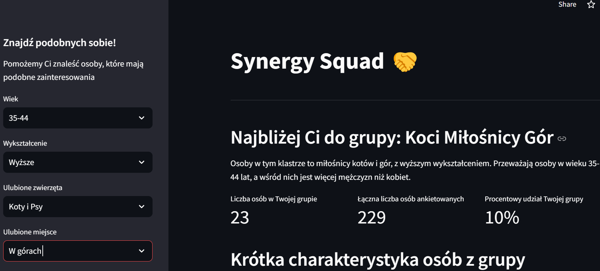
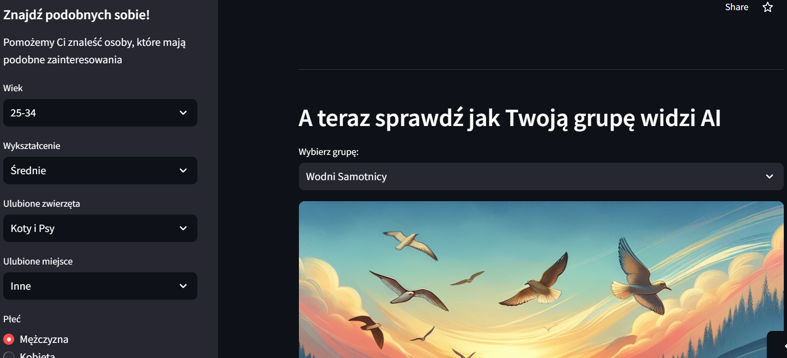

# **_Synergy Squad App - Course Participants Group Analysis App_**

*20.02.2025*

This Streamlit application is an advanced version of a previous project based on survey data from course participants. During the course, the data was cleaned and prepared for analysis, and in this version, it has been used for classification and clustering of users.

Using PyCaret, classification and clustering algorithms were applied to identify groups of participants with similar characteristics. Then, with OpenAI GPT-4o, descriptions and names for each cluster were generated, and DALL·E 3 created visual representations of each group based on the descriptions.

The app allows users to find a group of people with similar attributes, such as age, education level, or favorite animal, providing deeper insights into the course community and fostering potential new connections.

*Technologies and Tools Used:*

- Streamlit – a framework for building interactive web applications in Python,

- PyCaret – a machine learning library that automated the classification and clustering process,

- OpenAI GPT-4o – a language model used to generate descriptions and names for the created clusters,

- DALL·E 3 – an AI model for generating images, used to visualize each participant group,

- Python – the main programming language used for data analysis and application development,

- Git – a version control system supporting code management and collaboration.

*Same photos:*

[Go to application](https://synergy-squad-app.streamlit.app/){ .md-button }
[Go to repositories](https://github.com/KatarzynaGustak/synergy_squad_app){ .md-button }