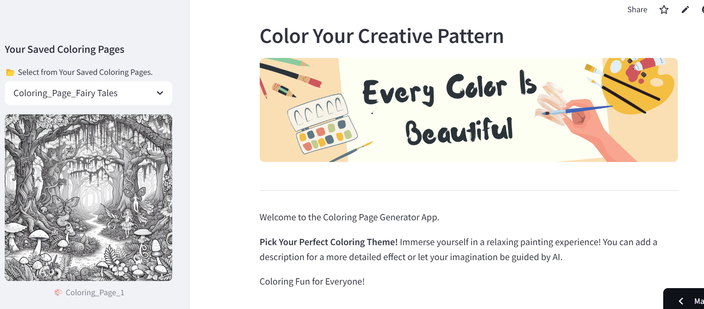
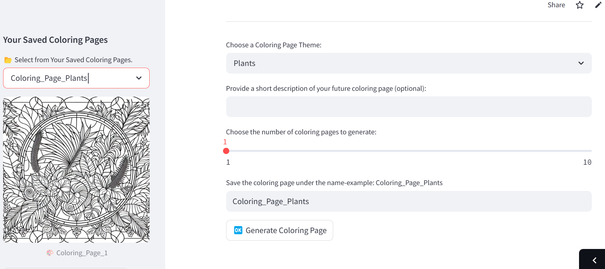
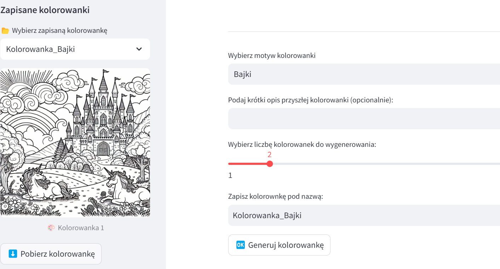

# ** _Color Your Creative Pattern!_**

*30.03.2025*

An interactive web application that enables the generation of personalized coloring pages using artificial intelligence. Users can choose the main theme of the coloring page, add their own detailed description, and specify the number of images to generate. 

The generation process works in two stages: first, the GPT-4o language model processes the user input and creates a detailed prompt describing the image content. Then, the DALL·E 3 model transforms that prompt into a black-and-white line drawing styled for coloring. 

Hosted on Streamlit Community Cloud, the app is easily accessible and user-friendly.

*Technologies and Tools Used*:

- Streamlit – a framework for building interactive web applications in Python,

- Git – version control and deployment,

- Pydantic, dotenv, requests – supporting libraries for validation, configuration, and API handling,

- Conda – for environment and dependency management,

- Visual Studio Code – the development environment,

- OpenAI DALL·E 3 – an image generation model that creates coloring-style graphics,

- OpenAI GPT-4o – a language model that generates creative prompts and descriptions,

- Python – programming language used for the project.

*Sample photos:*

[Go to audio notes](https://coloring-books-app.streamlit.app/){ .md-button }

[Go to repositories](https://github.com/KatarzynaGustak/coloring_books){ .md-button }