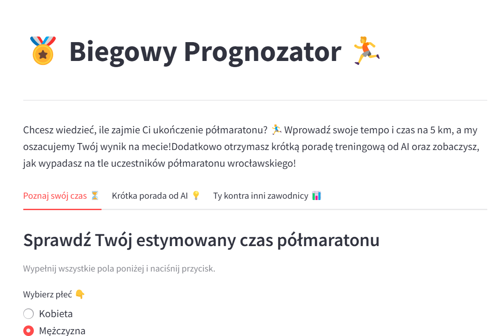
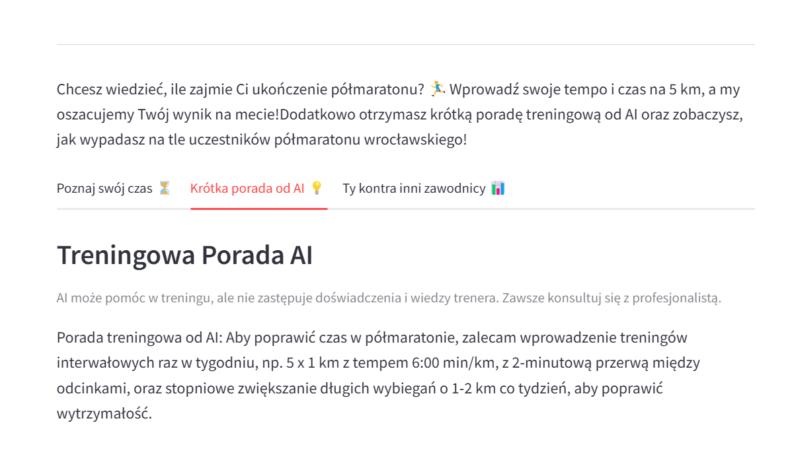
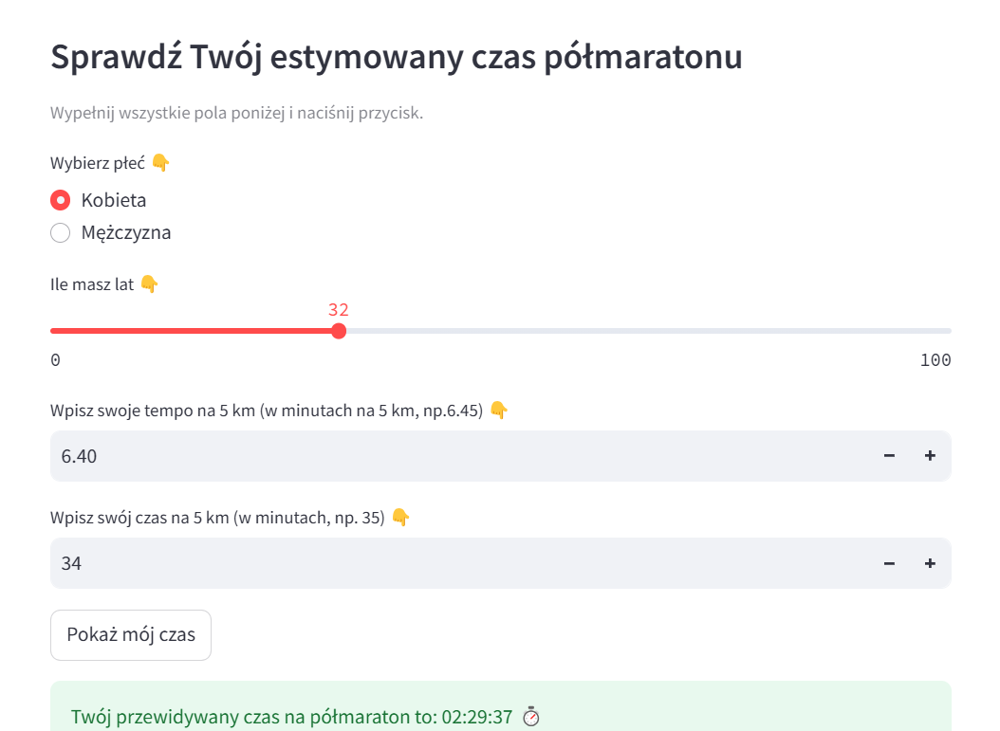
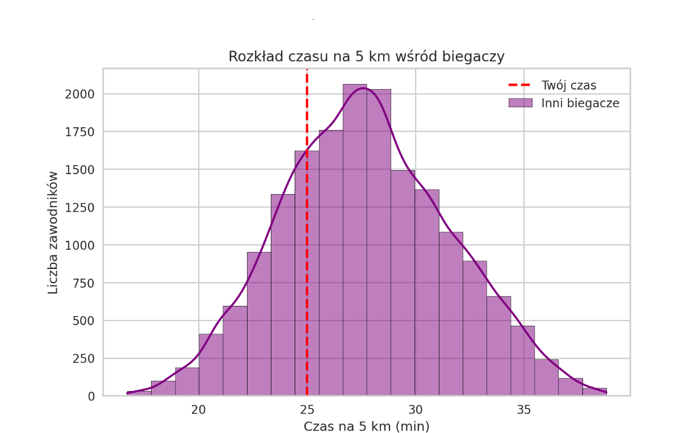

# ** _Biegowy Prognozator - Predictive App for Runners!_**

*04.04.2025*

Interactive web application created with running enthusiasts in mind. Based on basic user data (gender, age, time and pace for 5 km), it predicts potential half-marathon results and generates personalized training advice. 

The core of the application is a regression model trained using the PyCaret library on data from Wrocław Half Marathons from 2023-2024. The data was thoroughly cleaned and analyzed through exploratory data analysis (EDA), which allowed for the creation of an effective and reliable predictive model.

Personalized training tips are generated by GPT-4o, which adapts its advice to the individual runner’s profile.

The application also includes advanced data visualizations (Matplotlib, Seaborn), which enable comparison of the predicted result with the results of other runners from the same sporting events.

The solution is deployed on DigitalOcean App Platform, with Langfuse integrated to monitor model performance and prompt quality, ensuring transparency and trust in both predictions and AI-generated content..

*Technologies and Tools Used*:

- Streamlit – a framework for building interactive web applications in Python,

- Git – version control and deployment,

- PyCaret – machine learning library used for regression modeling,

- Conda – for environment and dependency management,

- Visual Studio Code – the development environment,

- OpenAI GPT-4o – language model for generating personalized training recommendations,

- Langfuse – monitoring of AI behavior and prompt analytics,

- Python – programming language used for the project,

- Matplotlib, Seaborn – data visualization and performance comparisons,

- Pandas, NumPy – data processing and numerical analysis,

- AWS (boto3) – integration with cloud services,

- DigitalOcean App Platform – hosting environment for deployment,

- dotenv – environment configuration and API key management.

*Sample photos:*

[Go to application](https://coloring-books-app.streamlit.app/){ .md-button }

[Go to repositories](https://github.com/KatarzynaGustak/coloring_books){ .md-button }