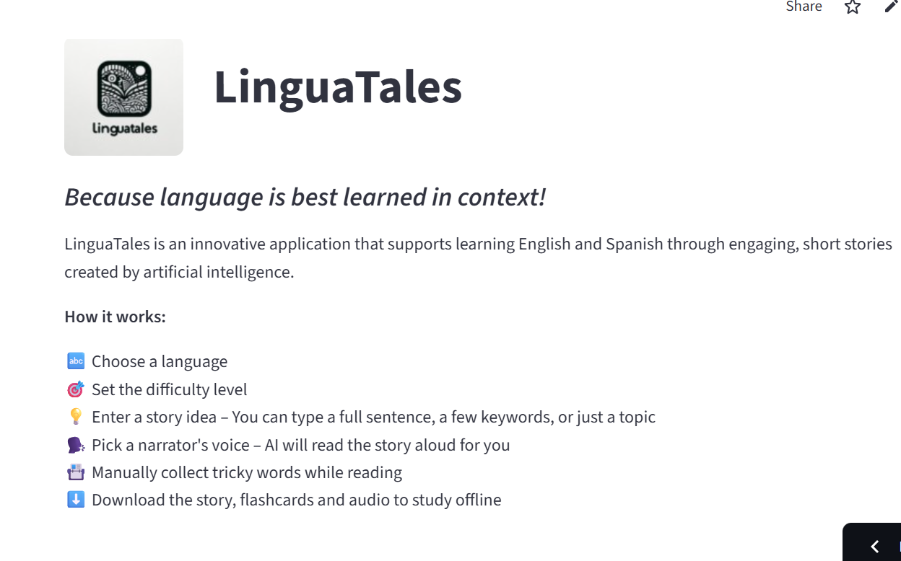
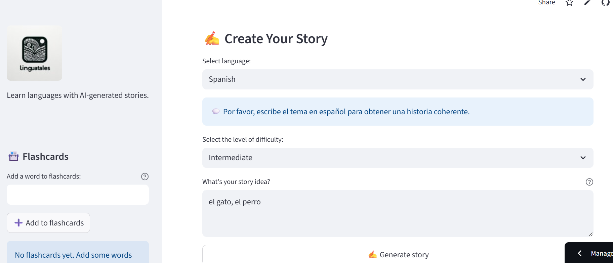
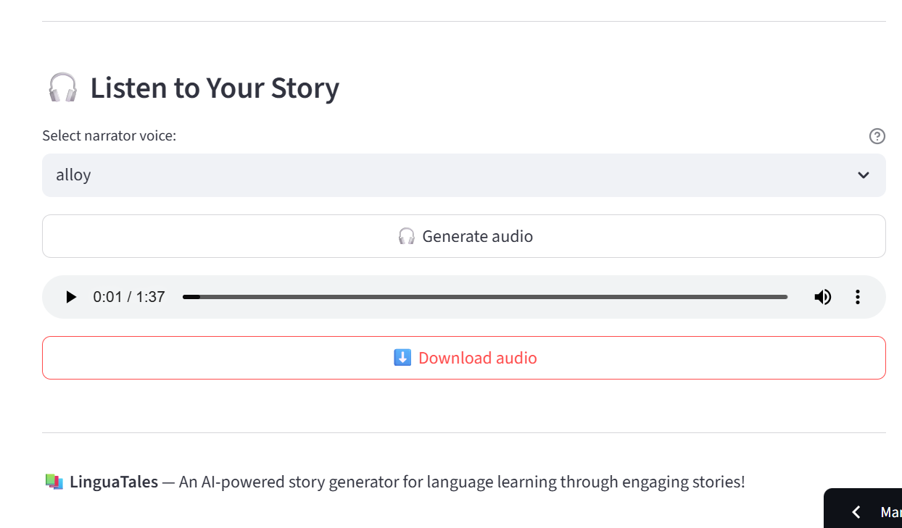

# ** _LinguaTales – Learn Languages Through AI-Generated Stories_**

*24.06.2025*

LinguaTales is a web application designed for language learners who want to expand their vocabulary and comprehension in English or Spanish through interactive storytelling. 

Users can select a language (English or Spanish) and specify their proficiency level (beginner, intermediate, advanced). The app then generates a unique story tailored to their input using GPT-4o. Additionally, users can listen to an audio version of the story using the TTS-1 model, choosing from a variety of AI voices.

The app offers customizable topics, vocabulary storage, and the ability to download content. 

Tested in the *Intercambio de Idiomas*community, LinguaTales has received very positive reviews for its usability and educational value.

*Technologies and Tools Used*:

- Streamlit – a framework for building interactive web applications in Python,

- Git – version control and deployment,

- Conda – for environment and dependency management,

- Visual Studio Code – the development environment,

- OpenAI GPT-4o –  LLM for generating context-based stories,

- OpenAI TTS-1 – for converting generated stories into audio with AI voices,

- Python – programming language used for the project,

- DigitalOcean App Platform – hosting environment for deployment,

- dotenv – environment configuration and API key management.

*Sample photos:*

[Go to application](https://lingua-tales.streamlit.app/){ .md-button }

[Go to repositories](https://github.com/KatarzynaGustak/Lingua-Tales){ .md-button }