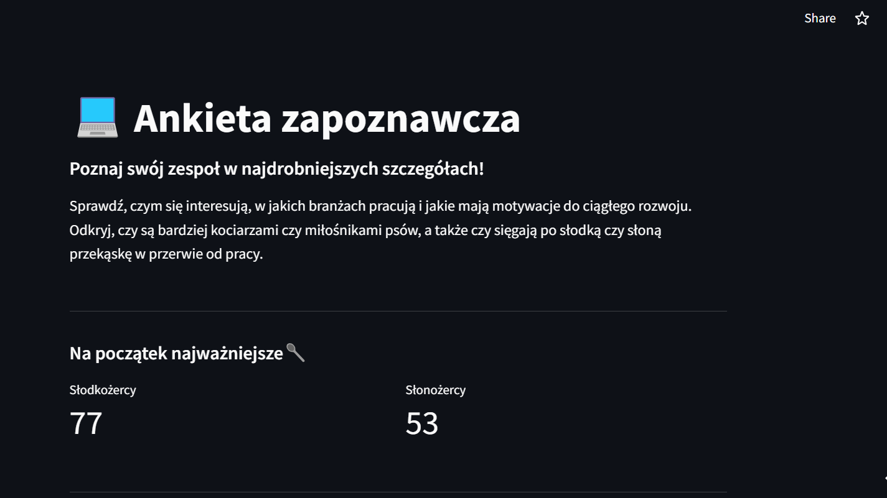
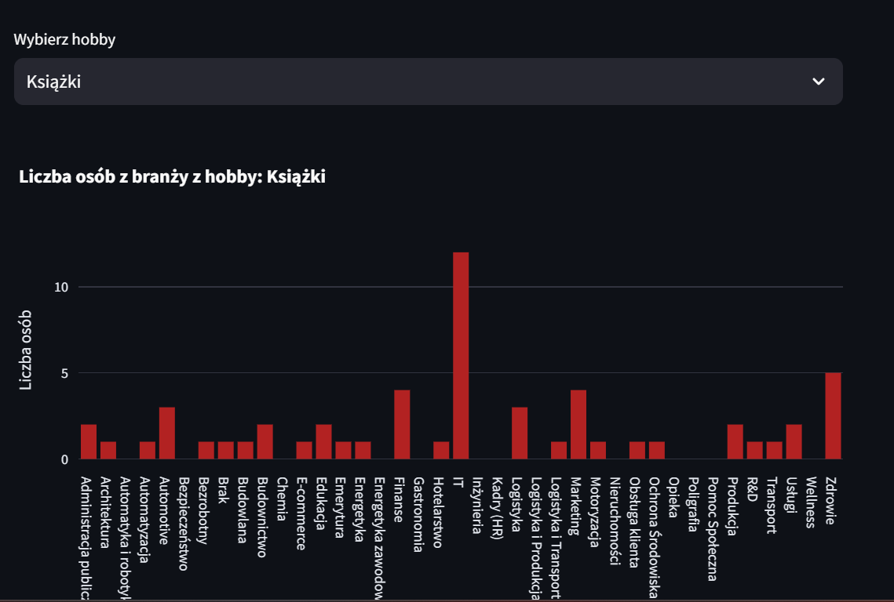
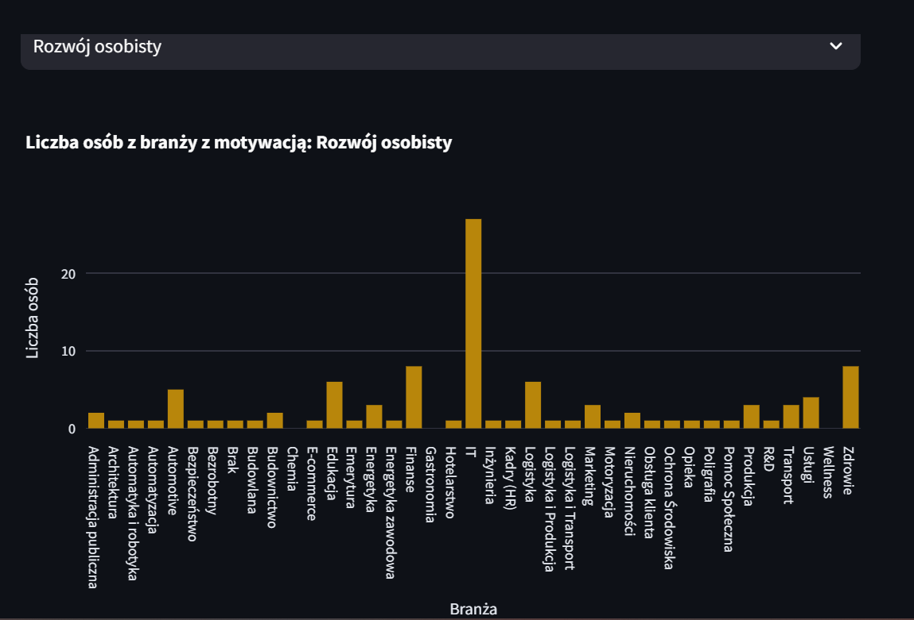

# ** _Welcome survey - Friends Course App_ **

*20.01.2025*

Friends Course App is a Streamlit-based app that allows for interactive exploration of data collected from a survey conducted at the beginning of the course. Participants answered questions about motivation for learning, preferred learning methods, and favorite animals, among other things.

The data was cleaned and prepared for analysis during the course, and the app allows users to visualize the data in an easy and accessible way. Using tools such as Streamlit and Pandas, the app allows users to view statistics and detailed information about course participants. Seaborn and Plotly  were used to create interactive graphs that present results in an engaging format.

The app is hosted on the Streamlit Community Cloud, providing easy access and a user-friendly interface.

*Technologies and Tools Used*:

- Git – version control system,

- Streamlit – framework for building web applications in Python,

- Pandas – Data processing and analysis,

- Seaborn, Plotly Express – Data visualization tools,

- Python – Programming language.

*Same photos:*

[Go to application](https://friends-course-app.streamlit.app/){ .md-button }
[Go to repositories](https://github.com/KatarzynaGustak/friends_course_app){ .md-button }